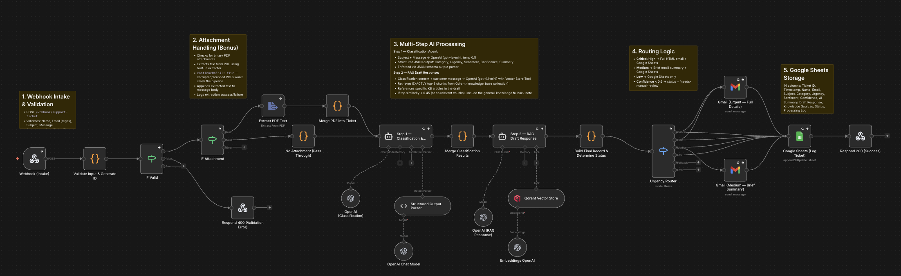

# Noavia AI Ticketing System

[](https://noavia.alielite.dev)
[](https://automation.noavia.alielite.dev)
[](https://github.com/ali-elite/noa-via-ai-task/releases)

An enterprise-grade, AI-powered support ticket system designed for **Noavia Process Intelligence**. This system automates the intake, classification, and resolution drafting of support inquiries using Retrieval-Augmented Generation (RAG).



## 🏗️ Key Architecture Decisions

1.  **Orchestration via n8n**: We chose n8n for its superior visibility and rapid iteration capabilities. By using native LangChain nodes, we could build a sophisticated multi-agent pipeline (Classification -> RAG Drafting) with a "human-in-the-loop" option for low-confidence tickets.
2.  **FastAPI Webhook Proxy**: Instead of exposing n8n's internal webhooks directly, a dedicated FastAPI portal handles request validation and multi-part file processing, providing a cleaner endpoint for the frontend.
3.  **Production-Ready Containerization**: Deployed using Docker Compose with **Traefik v3**. This ensures automated SSL/TLS termination via Let's Encrypt and secure proxying across three subdomains:
    *   `noavia.alielite.dev`: Customer Portal
    *   `automation.noavia.alielite.dev`: n8n Workflow Engine
    *   `qdrant.noavia.alielite.dev`: Multi-modal Vector Database

## 🛡️ AI Output Validation

To prevent hallucinations and inconsistent data, we implemented a **Structured Output Validation** strategy:
*   **JSON Enforcement**: The Classification agent uses a strict schema (Category, Urgency, Sentiment, Confidence) enforced by a `Structured Output Parser`.
*   **Confidence Guardrails**: Each classification includes a confidence score (0-1). If the score is below **0.6**, the system automatically flags the ticket for manual intervention and logs it to a "High Attention" sheet.
*   **Draft Verification**: The RAG-generated draft's source citations are cross-referenced with the knowledge base to ensure no "invented" policies reach the customer.

## 🧠 RAG Implementation Details

*   **Chunking Strategy**: A hybrid approach using `MarkdownHeaderTextSplitter` (to preserve semantic hierarchy) followed by `RecursiveCharacterTextSplitter` (chunk size: 1000, overlap: 150). This ensures that paragraph context remains intact while fitting within token limits.
*   **Embedding Model**: `text-embedding-3-small` by OpenAI. It offers the best balance of dimensionality (1536) and cost-efficiency for large documentation sets.
*   **Retrieval Approach**: Vector search via **Qdrant** using Cosine Similarity. We retrieve the top-3 most relevant segments, which are then passed to a LangChain Agent equipped with a `VectorStoreTool` for dynamic querying.

## 🧪 Setup & Deployment

1. **Environment Config**: Copy `.env.example` to `.env` and fill in your keys.
2. **Launch Stack**:
   ```bash
   docker-compose up -d --build
   ```
3. **Internal URLs**:
   *   n8n: `https://automation.noavia.alielite.dev`
   *   Portal: `https://noavia.alielite.dev`

## 🚀 Future Improvements

*   **RAG Evaluation**: Implementing **RAGAS** (RAG Assessment) framework to quantitatively measure Faithfulness and Answer Relevancy.
*   **Multi-Modal Intake**: Expanding the PDF extraction to handle images and diagrams within support documents using GPT-4o-vision.
*   **Automated Retraining**: A feedback loop where corrected support answers are automatically re-ingested into the vector database to improve future accuracy.
